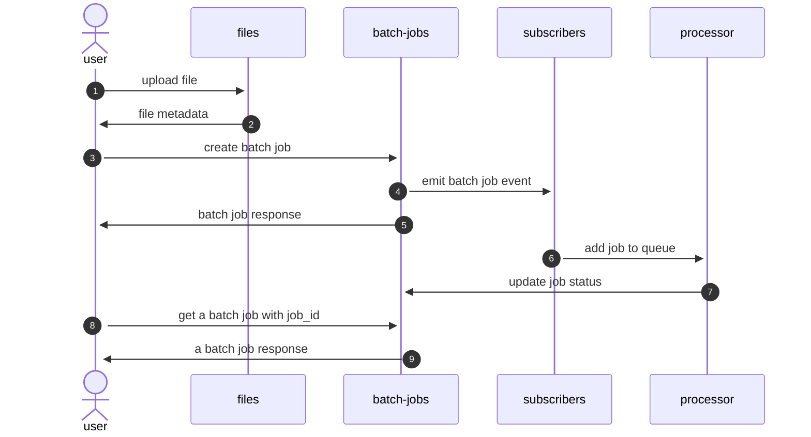
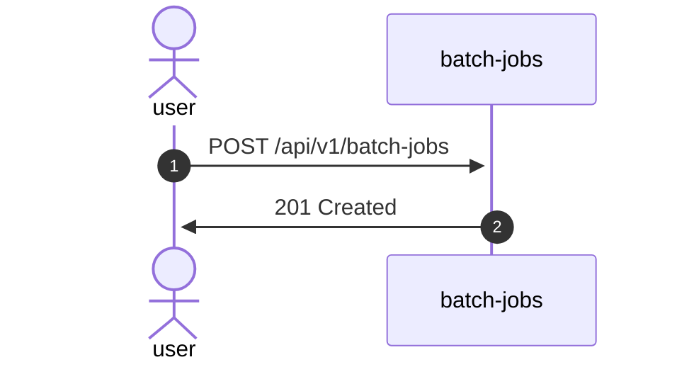
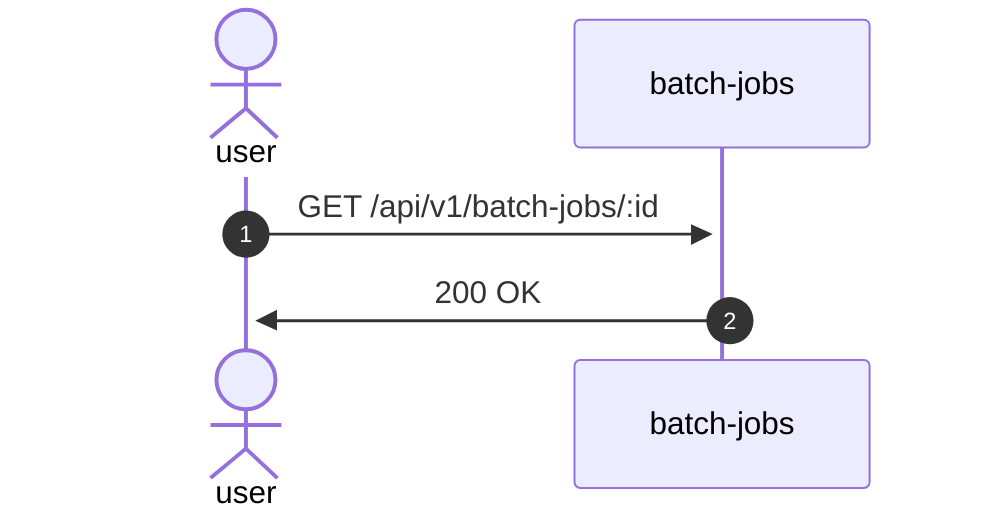

# brs


## Features

_Problem statement_: 

**Import the transactions to our system (transactions will be placed in Excel or CSV file)**

_Sample data format (.csv)_

| date                 | content        | amount   | type
| ---------------------| -------------- |----------|----------
| 21/03/2020 10:20:11  | Any text there | +100.000 | Deposit
| 20/03/2020 20:20:11  | Any text there | -50.000  | Withdraw

_Specification required_:
- [x] Provides API for client to call via HTTP(s) protocol to import the transactions
- [x] Each transaction will be 1 record in database
- [x] Note that Excel/CSV file can have more than 1 million of records
- [ ] Client must be authorized before import transactions (optional)

## Tech stack

- Typescript
- Nest.JS (Node.js framework) - SOLID principles 
- PostgreSQL
- TypeORM
- Bull (Queue processing)
- EventEmitter2
- ts-patterns (Pattern Matching library for TypeScript)

## Folder structure

```
src/
├── app
│   ├── batch-jobs # implement bacth-jobs module (/api/v1/batch-jobs)
│   │   ├── batch-job.type.ts
│   │   ├── batch-jobs.controller.spec.ts
│   │   ├── batch-jobs.controller.ts
│   │   ├── batch-jobs.module.ts
│   │   ├── batch-jobs.service.spec.ts
│   │   ├── batch-jobs.service.ts
│   │   ├── dtos
│   │   │   ├── create-batch-job.dto.ts
│   │   │   └── update-batch-job.dto.ts
│   │   ├── entities
│   │   │   └── batch-job.entity.ts
│   │   └── events
│   │       └── batch-job-submited.event.ts
│   ├── files # implement upload file (/api/v1/files/upload)
│   │   ├── files.controller.spec.ts
│   │   ├── files.controller.ts
│   │   ├── files.module.ts
│   │   ├── files.service.spec.ts
│   │   └── files.service.ts
│   ├── health # implement health check status (/api/v1/health)
│   │   ├── health.controller.spec.ts
│   │   ├── health.controller.ts
│   │   └── health.module.ts
│   ├── processor # implement queue processing task
│   │   ├── processor.module.ts
│   │   ├── processor.type.ts
│   │   └── transaction-import.processor.ts
│   ├── subscribers # listen event and add to queue task
│   │   ├── batch-job.subscriber.ts
│   │   └── subscribers.module.ts
│   └── transactions # implement transaction module
│       ├── transactions.entity.ts
│       └── transactions.module.ts
├── app.module.ts # main app module
├── config # config env
│   └── configuration.ts
├── main.ts # start server
└── utils # utils function
    ├── app-errors.ts
    ├── csv-parser.ts
    ├── str-to-datetime.ts
    └── xlsx-parser.ts
```

### Batch Jobs module

#### Batch Job workflow




#### Endpoint

**1. Create the new batch jobs**



Request body payload:
```
# CreateBatchJobDto
{
    type: BatchJobType | string;
    context: Record<string, any>;
}
```

Idea for the payload:
- easy to add more batch job type
- context with jsonb type on database, it can use config for the batch job task

ex:
```
context: {
    file_path: "uploads/250d0b5e-data_2.csv",
    skip: 100, # skip import first 100 record on the file (not implement)
    strict: true, # only import when all row is valid
    ...
}
```

**Try (Work with HTTP Client)**

```http
POST http://localhost:3000/api/v1/batch-jobs
content-type: application/json

{
    "type": "transaction-import",
    "context": {
        "file_path": "uploads/250d0b5e-data_2.csv",
        "strict": false
    }
}
```
Response:
```json
{
  "type": "transaction-import",
  "context": {
    "file_path": "uploads/250d0b5e-data_2.csv",
    "strict": false
  },
  "created_by": null,
  "result": null,
  "processing_at": null,
  "completed_at": null,
  "canceled_at": null,
  "failed_at": null,
  "job_id": "f0f15209-d75b-45a2-9672-ef7c7b8440f5",
  "status": "submitted",
  "submitted_at": "2022-10-25T06:49:08.728Z"
}
```


**2. Get batch job**


**Try (Work with HTTP Client)**

```http
GET http://localhost:3000/api/v1/batch-jobs/f0f15209-d75b-45a2-9672-ef7c7b8440f5
```

Response
```json
{
  "job_id": "f0f15209-d75b-45a2-9672-ef7c7b8440f5",
  "type": "transaction-import",
  "created_by": null,
  "status": "completed",
  "context": {
    "strict": false,
    "file_path": "uploads/250d0b5e-data_2.csv"
  },
  "result": {
    "count": 2,
    "message": null,
    "error_data": [
      
    ],
    "error_count": 0,
    "success_count": 2
  },
  "submitted_at": "2022-10-25T06:49:08.728Z",
  "processing_at": "2022-10-25T06:49:08.754Z",
  "completed_at": "2022-10-25T06:49:08.781Z",
  "canceled_at": null,
  "failed_at": null
}
```


## Quickstart

### Local development

1. Clone repo and install (require node version 16+)
```
git clone ...
cd ..

yarn
```

2. Start local database (require docker)
```
docker-compose up -d
```

3. Create .env file
```bash
PORT=3000
DATABASE_HOST=localhost
DATABASE_PORT=5432
DATABASE_NAME=postgres
DATABASE_USERNAME=postgres
DATABASE_PASSWORD=postgres
REDIS_HOST=localhost
REDIS_PORT=6379
```

4. Run migration
```
npm run migration:generate --name=init
npm run migration:run
```

Check table created in database:


5. Start development

```bash
yarn start:dev # hot reload

# other command
yarn build # build application
yarn start # start with build file
yarn test # test (not implement yet)
```

## Transaction import quick start 

1. Upload CSV/Excel

```bash
curl --location --request POST 'http://localhost:3000/api/v1/files/upload' \
  --form 'file=@"/Users/ant/Code/assignments/brs/mocks/data_2.csv"'
```

Response:
```json
{
    "file_path": "uploads/250d0b5e-data_2.csv"
}
```

2. Submit "transaction-import" batch job

```bash
curl --location --request POST 'localhost:3000/api/v1/batch-jobs' \
  --header 'Content-Type: application/json' \
  --data-raw '{
    "type": "transaction-import",
    "context": {
        "file_path": "uploads/250d0b5e-data_2.csv",
        "strict": false
    }
}'
```

Response:
```json
{
    "type": "transaction-import",
    "context": {
        "file_path": "uploads/250d0b5e-data_2.csv",
        "strict": false
    },
    "created_by": null,
    "result": null,
    "processing_at": null,
    "completed_at": null,
    "canceled_at": null,
    "failed_at": null,
    "job_id": "6f0ac278-2951-4baf-a921-72b925550c7a",
    "status": "submitted",
    "submitted_at": "2022-10-25T03:39:41.413Z"
}
```

3. Retrive batch job status

```bash
curl --location --request GET 'localhost:3000/api/v1/batch-jobs/6f0ac278-2951-4baf-a921-72b925550c7a'
```

Response:
```json
{
    "job_id": "6f0ac278-2951-4baf-a921-72b925550c7a",
    "type": "transaction-import",
    "created_by": null,
    "status": "completed",
    "context": {
        "strict": false,
        "file_path": "uploads/250d0b5e-data_2.csv"
    },
    "result": {
        "count": 2,
        "message": null,
        "error_data": [],
        "error_count": 0,
        "success_count": 2
    },
    "submitted_at": "2022-10-25T03:39:41.413Z",
    "processing_at": "2022-10-25T03:39:41.457Z",
    "completed_at": "2022-10-25T03:39:41.500Z",
    "canceled_at": null,
    "failed_at": null
}
```

### Try with other

1. data csv with 1 milions record

```bash
curl --location --request POST 'http://localhost:3000/api/v1/files/upload' \
  --form 'file=@"/Users/ant/Code/assignments/brs/mocks/data_1m_record.csv"'
  
# {"file_path":"uploads/87a51b1b-data_1m_record.csv"}

curl --location --request POST 'localhost:3000/api/v1/batch-jobs' \
  --header 'Content-Type: application/json' \
  --data-raw '{
    "type": "transaction-import",
    "context": {
        "file_path": "uploads/87a51b1b-data_1m_record.csv",
        "strict": false
    }
}'
# {"type":"transaction-import","context":{"file_path":"uploads/87a51b1b-data_1m_record.csv","strict":false},"created_by":null,"result":null,"processing_at":null,"completed_at":null,"canceled_at":null,"failed_at":null,"job_id":"5b5a27ee-1031-4257-b564-6f2c0435c115","status":"submitted","submitted_at":"2022-10-25T08:30:40.316Z"}%    

curl --location --request GET 'localhost:3000/api/v1/batch-jobs/5b5a27ee-1031-4257-b564-6f2c0435c115'
#{"job_id":"5b5a27ee-1031-4257-b564-6f2c0435c115","type":"transaction-import","created_by":null,"status":"completed","context":{"strict":false,"file_path":"uploads/87a51b1b-data_1m_record.csv"},"result":{"count":1000001,"message":null,"error_data":[],"error_count":0,"success_count":1000001},"submitted_at":"2022-10-25T08:30:40.316Z","processing_at":"2022-10-25T08:30:40.345Z","completed_at":"2022-10-25T08:32:24.692Z","canceled_at":null,"failed_at":null}
```


2. data excel with correct format

```bash
curl --location --request POST 'http://localhost:3000/api/v1/files/upload' \
  --form 'file=@"/Users/ant/Code/assignments/brs/mocks/data_2.xlsx"'
  
# {"file_path":"uploads/58f57033-data_2.xlsx"}

curl --location --request POST 'localhost:3000/api/v1/batch-jobs' \
  --header 'Content-Type: application/json' \
  --data-raw '{
    "type": "transaction-import",
    "context": {
        "file_path": "uploads/58f57033-data_2.xlsx",
        "strict": false
    }
}'
# {"type":"transaction-import","context":{"file_path":"uploads/58f57033-data_2.xlsx","strict":false},"created_by":null,"result":null,"processing_at":null,"completed_at":null,"canceled_at":null,"failed_at":null,"job_id":"0b9af4f9-7616-4ca7-b561-5f33f6c2924a","status":"submitted","submitted_at":"2022-10-25T07:41:10.477Z"}

curl --location --request GET 'localhost:3000/api/v1/batch-jobs/0b9af4f9-7616-4ca7-b561-5f33f6c2924a'

# {"job_id":"0b9af4f9-7616-4ca7-b561-5f33f6c2924a","type":"transaction-import","created_by":null,"status":"completed","context":{"strict":false,"file_path":"uploads/58f57033-data_2.xlsx"},"result":{"count":2,"message":null,"error_data":[],"error_count":0,"success_count":2},"submitted_at":"2022-10-25T07:41:10.477Z","processing_at":"2022-10-25T07:41:10.513Z","completed_at":"2022-10-25T07:41:10.548Z","canceled_at":null,"failed_at":null}
```

3. data csv with 1 incorrect format and context strict false

```bash
curl --location --request POST 'http://localhost:3000/api/v1/files/upload' \
  --form 'file=@"/Users/ant/Code/assignments/brs/mocks/data_error_2.csv"'
  
# {"file_path":"uploads/b73d2def-data_error_2.csv"}

curl --location --request POST 'localhost:3000/api/v1/batch-jobs' \
  --header 'Content-Type: application/json' \
  --data-raw '{
    "type": "transaction-import",
    "context": {
        "file_path": "uploads/b73d2def-data_error_2.csv",
        "strict": false
    }
}'

# {"type":"transaction-import","context":{"file_path":"uploads/b73d2def-data_error_2.csv","strict":false},"created_by":null,"result":null,"processing_at":null,"completed_at":null,"canceled_at":null,"failed_at":null,"job_id":"8dde13fb-2b92-46b2-88a1-fef99915cac8","status":"submitted","submitted_at":"2022-10-25T07:48:20.592Z"}%                               

curl --location --request GET 'localhost:3000/api/v1/batch-jobs/8dde13fb-2b92-46b2-88a1-fef99915cac8'

# {"job_id":"8dde13fb-2b92-46b2-88a1-fef99915cac8","type":"transaction-import","created_by":null,"status":"completed","context":{"strict":false,"file_path":"uploads/b73d2def-data_error_2.csv"},"result":{"count":6,"message":null,"error_data":[],"error_count":1,"success_count":5},"submitted_at":"2022-10-25T07:48:20.592Z","processing_at":"2022-10-25T07:48:20.622Z","completed_at":"2022-10-25T07:48:20.660Z","canceled_at":null,"failed_at":null}%                                                                                             
```
