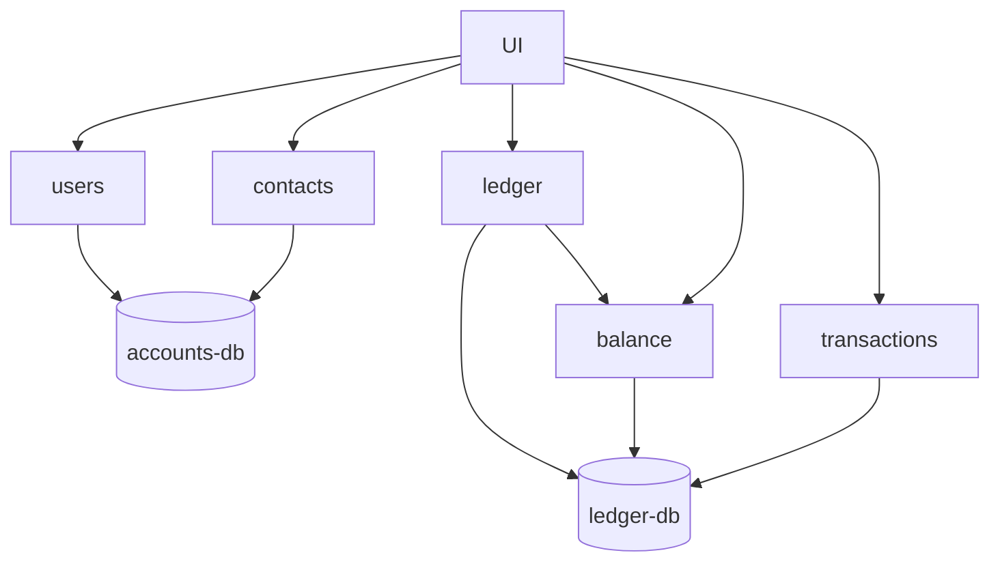

## Service architecture

```mermaid
graph TD;
    UI --> users;
    UI --> contacts;
    users --> db1[(accounts-db)];
    contacts --> db1[(accounts-db)];
    
    UI --> ledger;
    UI --> balance;
    UI --> transactions;
    ledger --> db2[(ledger-db)];
    balance --> db2[(ledger-db)];
    ledger --> balance;
    transactions --> db2[(ledger-db)];
    

```
